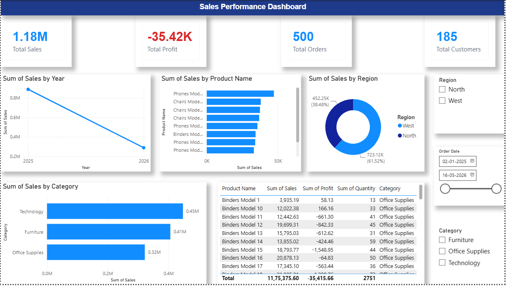

 Sales Dashboard of Dirty Superstore

## Description of the Project
The project is done in Microsoft Power BI.

## Dataset
Dirty Superstore Dataset

## Dashboard Highlights
- KPI of total sales
- KPI of total profit
- Total number of orders
- Sales per category
- Sales per region
- Profit analysis
- Sales trend per month

## Software Used
- Microsoft Power BI
- Power Query
- DAX

## Files
- Dirty_Superstore.pbix
- Dataset
- Dashboard Image

## Dashboard Screenshots

### Sales_Performance_Dashboard.png

